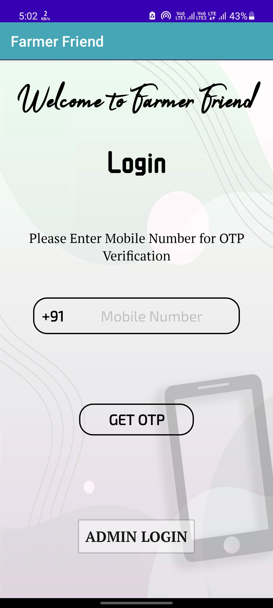
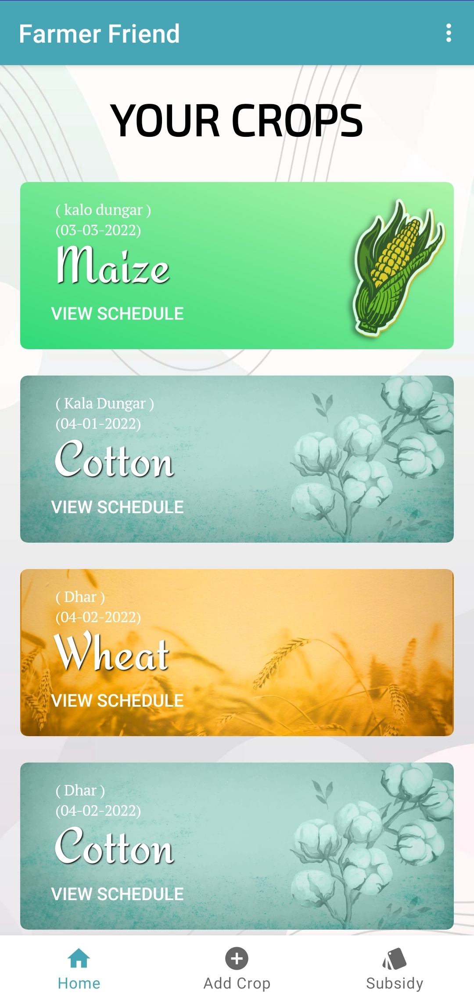
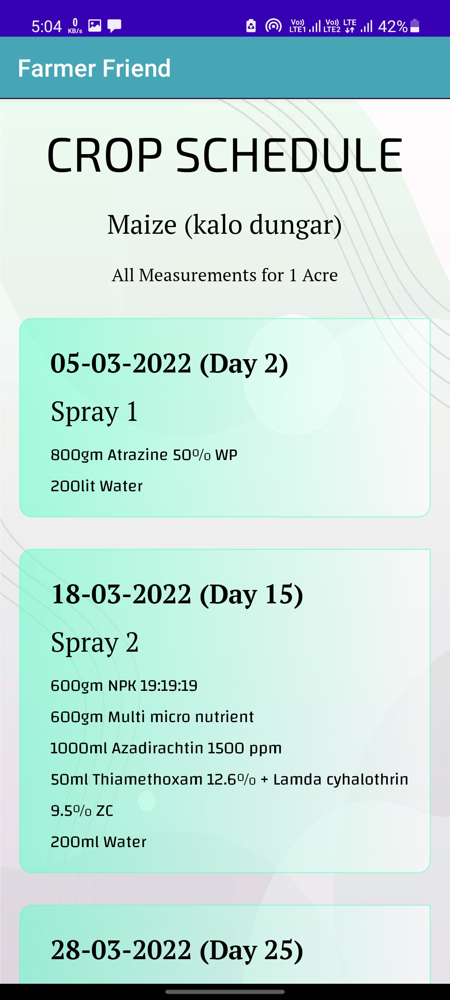
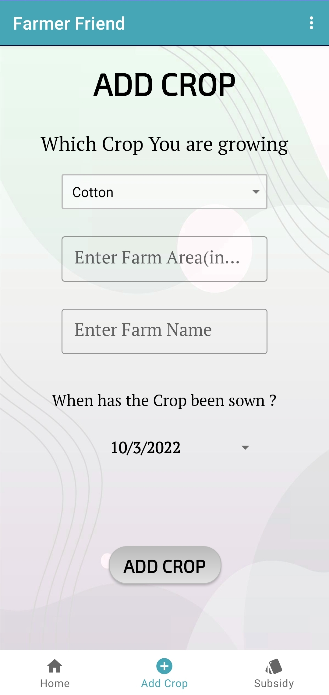
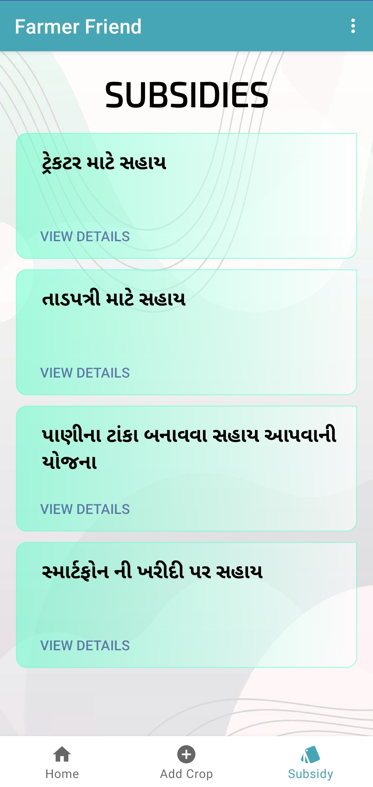
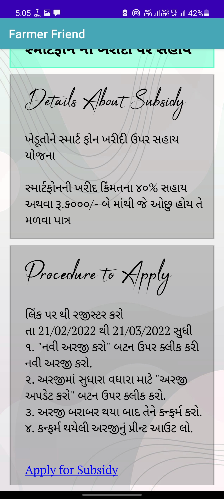

# Farmer Friend
Digital Crop Management System(Android Application)

Farmer Friend app is specifically design for farmers, to get details of fertilizer and pesticides’ time scheduling for their crops.
It also shows how much amount of fertilizer and pesticides required for the crops. This app also provides details about government subsidies 
for farmers, procedure to apply that subsidy with link of online application.

Login Page : Using Mobile Number and OTP farmer can log In  
  

Home Page : Where all Crops are Visible which is added by Farmer 
  

Crop Schedule Page : Schedule for Selected Crop is Visible  
  

Add Crop Page : Here Farmer can add Their Crop Details  
  

Subsidy Page : All subsidies which is available for farmer is visible  
  

Selected Subsidy Details Page : Here Details of selected subsidy is visible  
  
